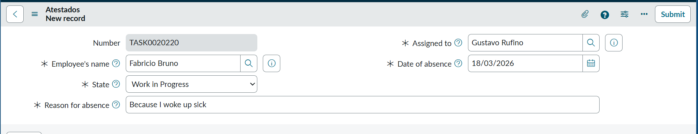
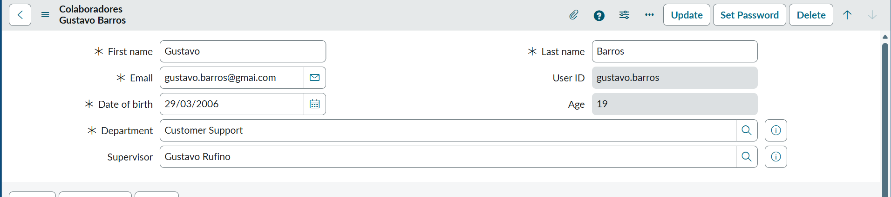
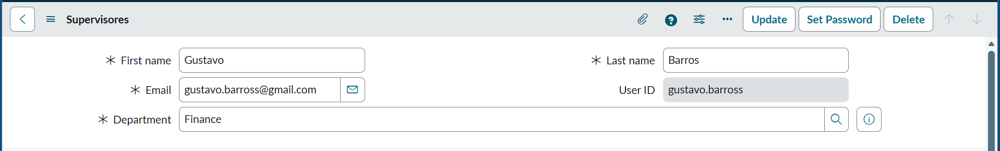
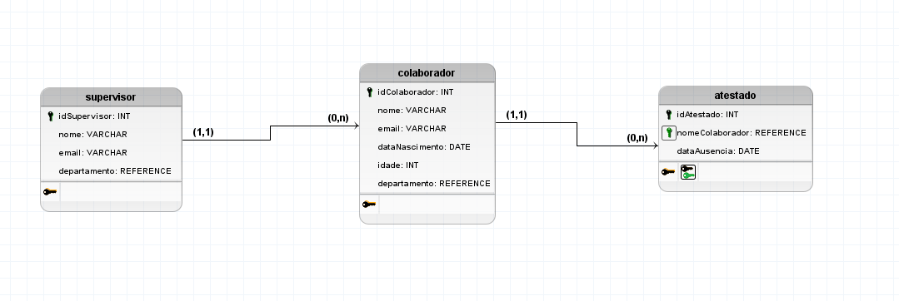
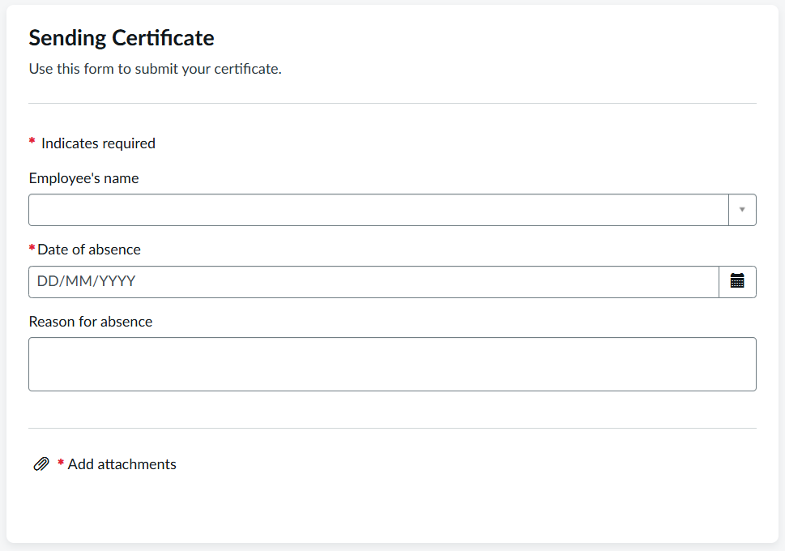
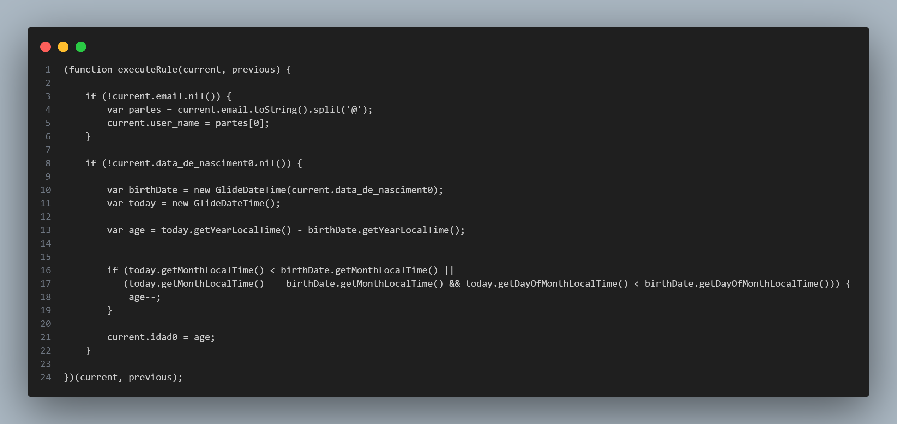
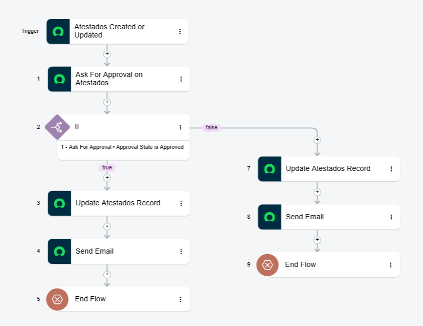

#  Sistema de Gestão de Atestados Médicos - ServiceNow

> **Desafio Prático - Trilha de ServiceNow para Estagiários (EDX)** 
> Projeto desenvolvido para digitalizar, automatizar e gerenciar o fluxo de envio e aprovação de atestados médicos dentro da plataforma ServiceNow.

---

##   Visão Geral do Projeto
O sistema gerencia as ausências, notifica automaticamente a liderança e exige a aprovação do supervisor direto do colaborador, mantendo a rastreabilidade na plataforma.

## 🗄️ Formulários

>**Formulário Atestados**

**Atestados (`x_..._atestado`):** Estendida da tabela nativa `Task`. Armazena os dados da ausência, motivo, datas, status de aprovação e o documento anexado. 

---

>**Formulário Colaborador**

 **Colaborador (`x_..._colaborador`):** Estendida da tabela nativa `sys_user` (User). Armazena os dados do funcionário, departamento, data de nascimento e a referência ao seu supervisor. 

---

>**Formulário Supervisor**

 **Supervisor (`x_..._supervisor`):** Estendida da tabela nativa `sys_user`. Armazena os dados da liderança responsável por validar os atestados. 

---

### 🎲 Modelo Lógico (Diagrama ER)

---

### 💻 Record Producer (Service Portal)
Interface para o usuário final enviar seu atestado médico, com obrigatoriedade de anexo.

---

## ⚙️ Regras de Negócio e Scripts (Adicionais)

Para garantir a integridade dos dados e melhorar a experiência, foram implementadas *Business Rules* em JavaScript.

**1. User ID Automático**
Script executado antes da inserção no banco de dados (`before insert`) que captura o e-mail corporativo preenchido e extrai automaticamente o prefixo para gerar o login (User ID) do colaborador.

**2. Cálculo Automático de Idade**
Script que utiliza a API `GlideDate` para calcular dinamicamente a idade atual do colaborador com base na Data de Nascimento informada no cadastro.

---

## 🤖 Automação de Processos (Flow Designer)
O coração da aplicação é um fluxo automatizado que gerencia o ciclo de vida do atestado.

**Ask for Approval do Supervisor:**

---
*Desenvolvido por Gustavo Rufino*
